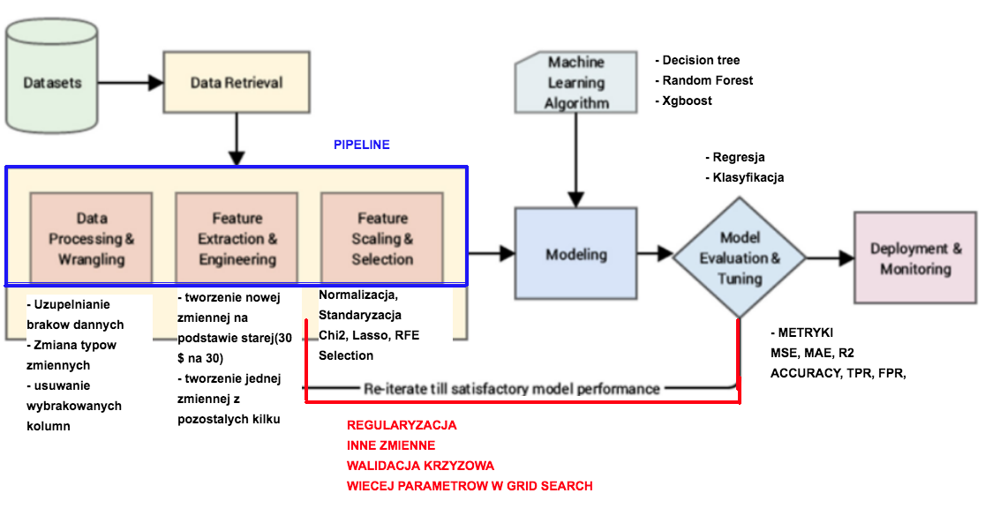

# Uczenie_maszynowe_w_Pythonie

```{python}

#zapisujemy model do pliku
def dump_to_pickle(model, filename: str)-> None:
  pickle.dump(model, open(filename, 'wb'))
  
#przyklad zapisania
model = DecisionTreeClassifier()
dump_to_pickle(dump_to_pickle, "model.pkl")

def load_from_pickle(filename):
    loaded_model = pickle.load(open(filename, 'rb'))
    return model

#przyklad odczytu

moj_model = load_from_pickle("model.pkl")


```


poczta130@gmail.com

Projekt grupowy
https://www.kaggle.com/cdabakoglu/heart-disease-classifications-machine-learning


https://colab.research.google.com/drive/1ost7KGIJsYmqFHB5tnVn0OgTNMTMaBMr#scrollTo=wr30ZUafywUr


Temat 8 PCA
https://colab.research.google.com/drive/1rc23lyz7I3UIeoF-Mox_GGZhrD46ss5-#scrollTo=k-V_pxXzAio5


Piatek: Link do danych
https://www.kaggle.com/cdabakoglu/heart-disease-classifications-machine-learning/data
https://archive.ics.uci.edu/ml/datasets/Heart+Disease





Link do prezentacji:

https://paper.dropbox.com/doc/Wstep-do-uczenia-maszynowego-vr2JPrhH3yiVm1hevTOsn


Temat4
https://colab.research.google.com/drive/1hAYerGZYBwLhzPf6-xLZS4t57q3oDYR2#scrollTo=pLBb_toqmTxM

Temat5
https://colab.research.google.com/drive/105n8hMNgfh-0u3UH0xZFmBaZjPG_sQ3_#scrollTo=y6jypVLldstF


Temat6
https://colab.research.google.com/drive/1FB4iaRjrpYo236UnvGQa7DIou_joJh_O#scrollTo=XybZjdr4W7o5


Plan na poniedziałek: Temat1, Temat2, Temat3


Linki do colab:


- Temat1_przygotowanie_danych_do_ML
https://colab.research.google.com/drive/1X5Gbmc5_9CQwCvhZpX20hH4IEdGyCWbr#scrollTo=Wkd0Pefdd3q1

- Temat2_regresja liniowa_ML
https://colab.research.google.com/drive/1iO1d6Fo804dr5xxrs07ioSB7yh-kyikv#scrollTo=_IIgtiJmSkz6

- Temat3_Regresja_Logiczna

https://colab.research.google.com/drive/1kSE07kAd6D9nRMaYrfzmzGOo7C0xLvyu#scrollTo=j9ITIgGKZgXq


Odpowiedzi na pytania:

- Mozna ustawic wyraz wolny w regresji logistycznej
LogisticRegression(fit_intercept =)

- R adjusted - dolozymy do w analizie.


